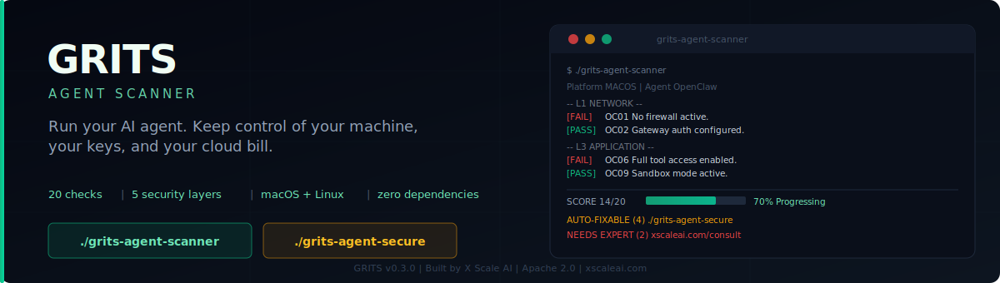

# GRITS Audit: AI Agent Security Scanner & Auto-Fixer

<p align="center">
  
</p>

[](LICENSE)
[](https://github.com/X-Scale-AI/grits-agent-scanner)
[]()
[](https://xscaleai.com)

70% of AI agent deployments ship with unrestricted access to your API keys, filesystem, and local network. Most operators never find out until something goes wrong.

**GRITS** scans your agent's live configuration, scores your security posture across 5 layers, and patches what it can automatically -- with a full backup and one-command rollback before touching anything.

---

## ⚡ Quick Start

```bash
git clone https://github.com/X-Scale-AI/grits-agent-scanner.git
cd grits-agent-scanner
chmod +x grits-*
./grits-audit
```

No dependencies. Python 3 stdlib only.

> **Record a 10-second `./grits-audit` GIF and drop it here.**

---

## What GRITS Finds

Most AI agent configs ship with the same class of vulnerabilities. GRITS surfaces them across five layers:

- **Credential leakage** -- API keys sitting in plaintext, credential files readable by any process on the host
- **Unauthorized filesystem access** -- agents running without sandboxing, able to read your SSH keys, `.env` files, and home directory
- **Unrestricted LAN exposure** -- a compromised agent that can reach every device on your network
- **Missing trust boundaries** -- no identity verification on who can command your agent, no isolation between agents sharing a host
- **Cloud cost bleed** -- unthrottled API usage, expensive model routing for tasks that could run locally, no spending caps

Run `./grits-audit` to see exactly what you're exposing and what can be fixed right now.

---

## How It Works

`./grits-audit` runs a three-step workflow:

1. **Scans** your live config and scores your posture
2. **Applies** auto-fixes with your confirmation -- backs up first, rolls back with one command
3. **Re-scans** and shows your before/after score improvement

For CI/CD pipelines, advanced output formats, and rollback options, run:

```bash
./grits-audit --help
./grits-agent-scanner --help
./grits-agent-secure --help
```

Currently supports **OpenClaw** and **NVIDIA NemoClaw**.

---

## The Baseline is Automated. The Hard Stuff Needs Expertise.

GRITS patches what can be scripted. Network segmentation, SIEM integration, zero-trust architecture, and compliance mapping require decisions specific to your infrastructure and your threat model.

If your scan output flags **Advanced Configurations** -- or if you are deploying agents in a production or regulated environment -- that is where X Scale AI comes in.

**[Book a free architecture review](https://xscaleai.com/consult)**

---

## Contributing

See [CONTRIBUTING.md](CONTRIBUTING.md). Issues and PRs welcome.
Vulnerabilities: [SECURITY.md](SECURITY.md).

---

<p align="center">
  Built by <a href="https://xscaleai.com">X Scale AI</a> &nbsp;|&nbsp;
  Apache 2.0 &nbsp;|&nbsp;
  <a href="https://xscaleai.com/consult">Free architecture review</a>
</p>
