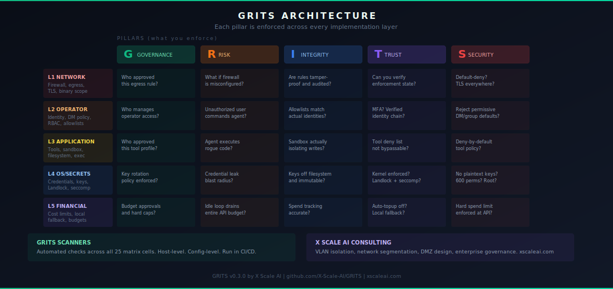

# GRITS Agent Scanner

**Run your AI agent. Keep control of your machine, your keys, and your cloud bill.**

<p align="center">
  
</p>

[](LICENSE)
[](https://github.com/X-Scale-AI/grits-agent-scanner)
[](https://xscaleai.com)

---

OpenClaw and NemoClaw are powerful. They are also running on your machine, with
access to your filesystem, your API keys, and your local network. Out of the box,
most configs leave real gaps -- gaps that a prompt injection, a rogue plugin, or a
misconfigured channel can walk right through.

GRITS Agent Scanner reads your actual config files, scores your security posture
across 5 layers, and tells you in plain language what each finding means and what to
do about it. The fixer handles what can be automated. The rest links to a 30-minute
call.

Nothing is modified until you say so.

---

## Scan in 30 Seconds

```bash
git clone https://github.com/X-Scale-AI/grits-agent-scanner.git
cd grits-agent-scanner

# OpenClaw
./grits-agent-scanner

# NVIDIA NemoClaw
./grits-agent-scanner --agent nemoclaw
```

**No dependencies.** Python 3 stdlib only. Works on macOS and Linux.

Example output:

```
====================================================================
  GRITS Agent Scanner  v0.3.0  by X Scale AI
====================================================================

  Platform  MACOS
  Agent     OpenClaw
  Config    /Users/you/.openclaw/openclaw.json

  L1 -- NETWORK
  [FAIL]  OC01  No firewall. A compromised agent can reach anything on the internet.
  [PASS]  OC02  Gateway requires authentication to connect.
  [PASS]  OC03  Gateway locked to this machine only. Other devices cannot reach it.
  [FAIL]  OC18  Agent can reach all devices on your LAN. Data exfiltration possible.

  L2 -- OPERATOR
  [PASS]  OC04  Only approved users can message your agent.
  [PASS]  OC05  Group chat commands restricted to approved users.

  L3 -- APPLICATION
  [FAIL]  OC06  Full tool access enabled. Prompt injection can abuse every tool.
  [PASS]  OC07  Dangerous tools are on the deny list.
  [PASS]  OC09  Sandbox mode active. Agent workspace is isolated.

  L4 -- OS/SECRETS
  [PASS]  OC11  No plaintext API keys found in config.
  [FAIL]  OC12  Secrets file readable by other users. Your API keys are exposed.

  L5 -- FINANCIAL
  [FAIL]  OC14  Heartbeat burning expensive cloud API credits for a simple ping.
  [PASS]  OC16  No dangerous runtime flags detected.

--------------------------------------------------------------------
  SCORE   11/20   ███████████░░░░░░░░░   55%   BASELINE

  AUTO-FIXABLE NOW (4 issues)
  Run:  ./grits-agent-secure

  NEEDS AN EXPERT (5 issues)
  Schedule a free 30-min call:  https://xscaleai.com/consult
====================================================================
```

---

## Fix What's Broken (Automatically)

```bash
# Preview what would change -- nothing is modified:
./grits-agent-secure

# Apply fixes (backs up everything first, only adds, never replaces):
./grits-agent-secure --apply
```

**Before touching anything, the fixer:**
1. Shows you every change that will be made
2. Creates a full backup with a rollback command
3. Asks for your confirmation

**What the fixer handles automatically:**

| Fix | What changes | What stays the same |
|---|---|---|
| Enable firewall | UFW (Linux) or Application Firewall (macOS) | Existing rules untouched |
| Block dangerous tools | Appends to deny list | Tools you allow are not removed |
| Enable sandbox mode | Sets `agent.sandbox: true` | All other agent settings |
| Fix file permissions | `.env` and `credentials/` locked to owner-only | File contents unchanged |
| Disable dangerous flags | Sets yolo/trustAll/autoApprove to false | Keys stay in config |

**To roll back at any time:**

```bash
# The fixer shows this command before it does anything:
cp ~/.openclaw/grits-backups/TIMESTAMP/openclaw.json ~/.openclaw/openclaw.json
```

---

## The 5-Layer Zero-Trust Model

<p align="center">
  
</p>

| Layer | Boundary | Threat | Checks |
|---|---|---|---|
| 1 Network | Host firewall / egress policy | Agent attacks local infrastructure | OC01, OC02, OC03, OC18 |
| 2 Operator | Identity verification | Unauthorized users command the agent | OC04, OC05, OC17, OC19 |
| 3 Application | Tool permissions / sandbox | Agent executes rogue code | OC06, OC07, OC08, OC09, OC10 |
| 4 OS/Secrets | Credential isolation | Workspace leak exposes API keys | OC11, OC12, OC13, OC20 |
| 5 Financial | Cost containment | Context bloat or runaway loops drain budget | OC14, OC15, OC16 |

---

## What Needs an Expert

Some issues cannot be automated -- they require decisions about your infrastructure,
your identity setup, or your organization's threat model.

| Issue | Why it can't be automated |
|---|---|
| Network segmentation | VLAN/subnet design specific to your environment |
| Gateway authentication | You choose the token, policy, and user allowlists |
| API key migration | You choose the secrets backend (Vault, AWS SM, etc.) |
| Audit logging | Depends on your SIEM (Datadog, Splunk, Elastic, etc.) |
| Spending limits | Set at your API provider, varies by vendor |
| Multi-agent isolation | Architectural decision about trust boundaries |

**[Schedule a free 30-min call](https://xscaleai.com/consult)**

---

## Output Formats

```bash
# Terminal (default) -- color output, designed for screenshots
./grits-agent-scanner

# Markdown -- for PRs, wikis, security reports
./grits-agent-scanner --report > security-report.md

# JSON -- for dashboards, CI/CD, automation
./grits-agent-scanner --json > scan-results.json
```

---

## Quick Checklists

Five yes/no checklists, one per layer. Share them with your team.

| Layer | Checklist |
|---|---|
| 01 Network | [checklists/01-network-safety.md](checklists/01-network-safety.md) |
| 02 Operator | [checklists/02-operator-identity.md](checklists/02-operator-identity.md) |
| 03 Application | [checklists/03-tool-permissions.md](checklists/03-tool-permissions.md) |
| 04 OS/Secrets | [checklists/04-secrets-exposure.md](checklists/04-secrets-exposure.md) |
| 05 Financial | [checklists/05-cost-exposure.md](checklists/05-cost-exposure.md) |

---

## Hardening Guides

| Agent | Guide | What it covers |
|---|---|---|
| OpenClaw | [apply/openclaw/](apply/openclaw/) | 5-Layer Zero-Trust hardening: firewall, identity, tools, secrets, cost |
| NVIDIA NemoClaw | [apply/nemoclaw/](apply/nemoclaw/) | Binary scoping, filesystem policy, inference cost controls |

---

## Reference Configs

Pre-hardened configs ready to diff and apply. See
[score/configs/install-guide.md](score/configs/install-guide.md) for setup
instructions including environment variable injection.

| Config | What it is |
|---|---|
| `score/configs/openclaw.json.default` | Vanilla OpenClaw config |
| `score/configs/openclaw.json.hardened.linux` | Hardened Linux config |
| `score/configs/openclaw.json.hardened.mac` | Hardened macOS config |

---

## Host Hardening Scripts

Automated OS-level hardening aligned to CIS Benchmarks and DISA STIGs.

```bash
# Linux host
sudo bash tools/harden.sh

# Docker host
sudo bash tools/harden-docker.sh
```

Review the configuration section at the top of each script before running.

---

## Attribution Required

Apache 2.0 licensed. Use, modify, and distribute freely.

One requirement: any use of GRITS scoring output must retain the attribution line:

> Scored with GRITS by X Scale AI

See the [NOTICE](NOTICE) file for full attribution requirements.

---

## Built on the GRITS Framework

This scanner implements the [GRITS Framework](https://github.com/X-Scale-AI/GRITS)
-- the governance spec, control catalog, lifecycle model, and compliance mappings
that define the 5-Layer Zero-Trust model for AI agents.

---

## Need Help?

The scanner and fixer are free and open source.

For the issues that require architecture decisions, infrastructure changes, or
organizational context -- network segmentation, secrets architecture, identity
setup, audit logging, multi-agent trust boundaries:

**[Schedule a free 30-min call with an X Scale AI security engineer](https://xscaleai.com/consult)**

---

## Contributing

See [CONTRIBUTING.md](CONTRIBUTING.md). Issues and PRs welcome.
Report security vulnerabilities per [SECURITY.md](SECURITY.md).

---

<p align="center">
  <strong>GRITS v0.3.0</strong><br>
  Built by <a href="https://xscaleai.com">X Scale AI</a> &nbsp;|&nbsp;
  Apache 2.0 &nbsp;|&nbsp;
  <a href="https://xscaleai.com/consult">Free 30-min hardening call</a>
</p>
